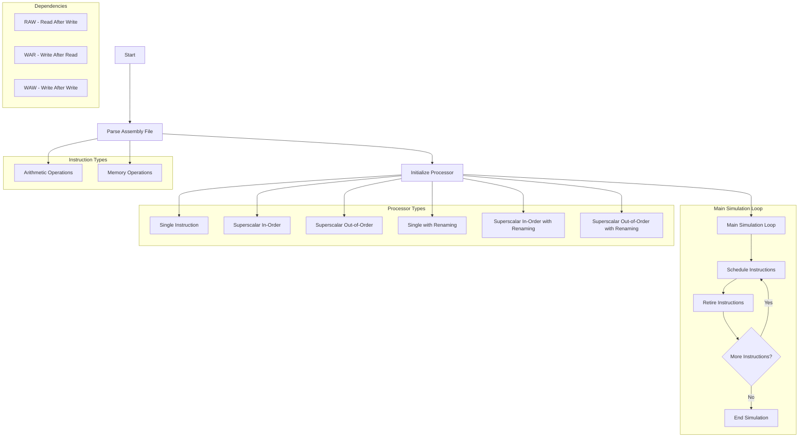

```mermaid
graph TD
    A[Start] --> B[Parse Assembly File]
    B --> C[Initialize Processor]
    C --> D[Main Simulation Loop]
    
    subgraph "Main Simulation Loop"
        D --> E[Schedule Instructions]
        E --> F[Retire Instructions]
        F --> G{More Instructions?}
        G -->|Yes| E
        G -->|No| H[End Simulation]
    end
    
    subgraph "Processor Types"
        I[Single Instruction]
        J[Superscalar In-Order]
        K[Superscalar Out-of-Order]
        L[Single with Renaming]
        M[Superscalar In-Order with Renaming]
        N[Superscalar Out-of-Order with Renaming]
    end
    
    subgraph "Instruction Types"
        O[Arithmetic Operations]
        P[Memory Operations]
    end
    
    subgraph "Dependencies"
        Q[RAW - Read After Write]
        R[WAR - Write After Read]
        S[WAW - Write After Write]
    end
    
    C --> I & J & K & L & M & N
    B --> O & P
```